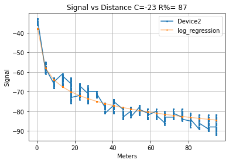
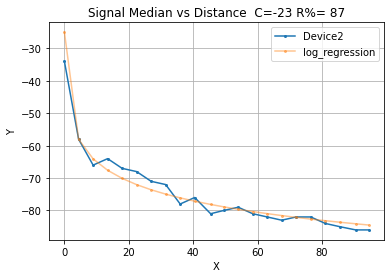
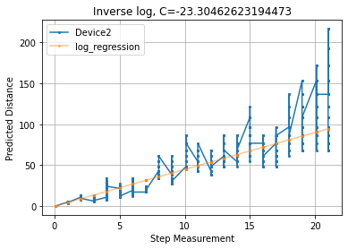
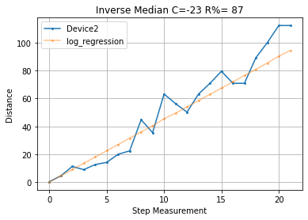

# Median Filter and Log Fit for RSSI signal prediction on ESP8266

## Getting Started

### Project requirements 

First step is to create one and install all necessary project requirements.

    virtualenv env --python=python3
    source env/bin/activate
    pip install -r requirements.txt

## Execution

    python main.py [--file /path/to/file]

You can set the path to a file containing your data, default path is _data/Device.csv_.

For example:

    main.py --file data/sample.csv

## Results

